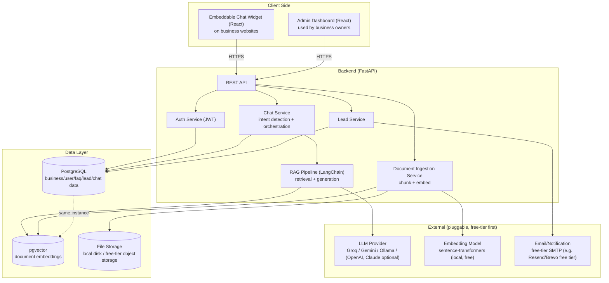

# ChatBiz — Architecture Document

## 1. System Overview

Multi-tenant SaaS. Each business ("tenant") has isolated data (FAQs, documents, leads, conversations) but shares the same application and infrastructure, distinguished by `business_id`.

## 2. Components

### 2.1 Chat Widget (React, embeddable)
- Ships as a small standalone JS bundle loaded via ``.
- Talks only to the public chat API (`/api/chat/*`) — no admin credentials.
- Renders in an iframe or shadow DOM to avoid CSS collisions with the host site.

### 2.2 Admin Dashboard (React)
- Authenticated SPA for business owners.
- Manages FAQs, documents, products/services, branding, leads, conversation history, analytics.

### 2.3 Backend API (FastAPI)
- Stateless REST API, horizontally scalable.
- Routers: `auth`, `businesses`, `faqs`, `documents`, `products`, `chat`, `leads`, `analytics`.
- All authenticated routes resolve `business_id` from the JWT — never trust a client-supplied tenant ID for writes.

### 2.4 RAG Pipeline (LangChain, Python)
1. Document uploaded → text extracted → chunked (e.g. 500–800 tokens, overlap ~50).
2. Chunks embedded via `sentence-transformers` (local, free) and stored in `document_chunks` with `business_id` + pgvector embedding column.
3. On a chat message: embed the query, retrieve top-k chunks scoped to `business_id` via pgvector similarity search, build a grounded prompt, call the LLM provider.
4. If retrieval confidence is low → fallback to rule-based FAQ match or "let me connect you with the team" + lead capture prompt.

### 2.5 LLM Provider Abstraction
- Common interface (`generate(prompt, context) -> text`) with adapters for Groq, Google Gemini, local Ollama, OpenAI, Claude.
- Default to a free-tier provider; business/tenant config can override which provider/model to use.

### 2.6 Lead Capture
- Triggered by explicit form fill or detected "lead" intent mid-conversation.
- Stored in `leads` table; optionally emailed to the business via free-tier transactional email.

## 3. Multi-Tenancy Approach

- **Shared database, shared schema, tenant column** (`business_id` on every tenant-scoped table) — simplest and cheapest for MVP; can graduate to schema-per-tenant later if a client needs stronger isolation.
- Row-level filtering enforced in the service layer (and optionally Postgres Row-Level Security later).

## 4. API Endpoints (MVP)

### Auth
- `POST /api/auth/register` — create business + owner account
- `POST /api/auth/login` — returns JWT
- `POST /api/auth/refresh`

### Business / Admin
- `GET /api/businesses/me`
- `PATCH /api/businesses/me` — branding, hours, contact info

### FAQs
- `GET /api/faqs`
- `POST /api/faqs`
- `PATCH /api/faqs/{id}`
- `DELETE /api/faqs/{id}`

### Documents (knowledge base)
- `GET /api/documents`
- `POST /api/documents` — upload, triggers chunk+embed job
- `DELETE /api/documents/{id}`

### Products/Services
- `GET /api/products`
- `POST /api/products`
- `PATCH /api/products/{id}`
- `DELETE /api/products/{id}`

### Chat (public, widget-facing)
- `POST /api/chat/message` — `{business_id, session_id, message}` → AI/fallback response
- `GET /api/chat/history/{session_id}`

### Leads
- `GET /api/leads`
- `POST /api/leads` — from widget or detected intent
- `PATCH /api/leads/{id}` — status update (new/contacted/won/lost)

### Analytics
- `GET /api/analytics/summary` — conversation count, lead count, top questions

## 5. Deployment Topology (MVP, free-tier)

- **Frontend (widget + dashboard)**: static build, hosted on Vercel/Netlify/Render free tier.
- **Backend**: Dockerized FastAPI on Render/Railway/Fly.io free tier.
- **Database**: PostgreSQL with pgvector — free-tier managed instance (e.g. Render/Supabase free tier) or self-hosted in Docker for local dev.
- **CI/CD**: GitHub Actions — lint, test, build, deploy on merge to `main`.
- **Secrets**: environment variables in the hosting provider's dashboard, never committed.

## 6. Security Notes

- JWT auth, hashed passwords (`passlib` bcrypt).
- Rate limit the public `/api/chat/message` endpoint to prevent abuse/cost overrun on LLM calls.
- Validate and sandbox uploaded documents (file type/size limits) before parsing.
- CORS restricted to registered business domains for widget embeds where feasible.
