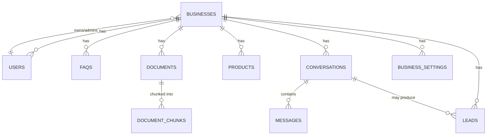

# ChatBiz — Database Schema (PostgreSQL + pgvector)

## Conventions
- Every tenant-scoped table has a `business_id UUID` foreign key, indexed.
- All tables have `id UUID PRIMARY KEY DEFAULT gen_random_uuid()`, `created_at`, `updated_at`.
- `pgvector` extension enabled: `CREATE EXTENSION IF NOT EXISTS vector;`

## Entity Overview

## Tables

### `businesses`
| Column | Type | Notes |
|---|---|---|
| id | UUID PK | |
| name | TEXT | |
| slug | TEXT UNIQUE | used in embed script / subdomain |
| industry | TEXT | retail, restaurant, clinic, real_estate, service, other |
| logo_url | TEXT | nullable |
| primary_color | TEXT | for widget theming |
| plan | TEXT | free / basic / growth / custom |
| status | TEXT | active / trial / suspended |
| created_at | TIMESTAMPTZ | |
| updated_at | TIMESTAMPTZ | |

### `users`
| Column | Type | Notes |
|---|---|---|
| id | UUID PK | |
| business_id | UUID FK → businesses.id | owner/admin's primary business |
| email | TEXT UNIQUE | |
| hashed_password | TEXT | |
| full_name | TEXT | |
| role | TEXT | owner / staff |
| is_active | BOOLEAN | |
| created_at | TIMESTAMPTZ | |

### `business_settings`
| Column | Type | Notes |
|---|---|---|
| id | UUID PK | |
| business_id | UUID FK, UNIQUE | 1:1 with businesses |
| tone | TEXT | friendly / formal / concise / playful |
| welcome_message | TEXT | |
| fallback_message | TEXT | shown when AI is unsure |
| business_hours | JSONB | e.g. `{ "mon": "9-18", ... }` |
| contact_email | TEXT | |
| contact_phone | TEXT | |
| languages | TEXT[] | e.g. `{en}`, later `{en,th,hi}` |
| llm_provider | TEXT | groq / gemini / ollama / openai / claude |
| llm_model | TEXT | provider-specific model name |

### `faqs`
| Column | Type | Notes |
|---|---|---|
| id | UUID PK | |
| business_id | UUID FK | indexed |
| question | TEXT | |
| answer | TEXT | |
| category | TEXT | nullable |
| is_active | BOOLEAN | |
| created_at | TIMESTAMPTZ | |
| updated_at | TIMESTAMPTZ | |

### `documents`
| Column | Type | Notes |
|---|---|---|
| id | UUID PK | |
| business_id | UUID FK | indexed |
| filename | TEXT | |
| file_url | TEXT | storage path/URL |
| file_type | TEXT | pdf / docx / txt / csv |
| status | TEXT | pending / processing / embedded / failed |
| uploaded_by | UUID FK → users.id | |
| created_at | TIMESTAMPTZ | |

### `document_chunks`
| Column | Type | Notes |
|---|---|---|
| id | UUID PK | |
| business_id | UUID FK | indexed — critical for scoped retrieval |
| document_id | UUID FK → documents.id | |
| chunk_index | INTEGER | order within document |
| content | TEXT | chunk text |
| embedding | VECTOR(384) | dimension depends on embedding model (e.g. 384 for MiniLM) |
| created_at | TIMESTAMPTZ | |

Index: `CREATE INDEX ON document_chunks USING ivfflat (embedding vector_cosine_ops);` (plus a btree index on `business_id`).

### `products` (products or services)
| Column | Type | Notes |
|---|---|---|
| id | UUID PK | |
| business_id | UUID FK | indexed |
| name | TEXT | |
| description | TEXT | |
| price | NUMERIC | nullable |
| currency | TEXT | default 'USD' |
| image_url | TEXT | nullable |
| category | TEXT | nullable |
| is_active | BOOLEAN | |
| created_at | TIMESTAMPTZ | |

### `conversations`
| Column | Type | Notes |
|---|---|---|
| id | UUID PK | |
| business_id | UUID FK | indexed |
| session_id | TEXT | widget-generated, groups messages per visitor session |
| visitor_id | TEXT | nullable, for returning-visitor tracking (cookie/local id) |
| channel | TEXT | website_widget / (future: whatsapp, fb) |
| status | TEXT | open / closed / handed_off |
| started_at | TIMESTAMPTZ | |
| ended_at | TIMESTAMPTZ | nullable |

### `messages`
| Column | Type | Notes |
|---|---|---|
| id | UUID PK | |
| conversation_id | UUID FK → conversations.id | indexed |
| sender | TEXT | visitor / ai / human_agent |
| content | TEXT | |
| intent | TEXT | nullable — faq / lead / product_inquiry / support / other |
| confidence | FLOAT | nullable — retrieval/generation confidence score |
| created_at | TIMESTAMPTZ | |

### `leads`
| Column | Type | Notes |
|---|---|---|
| id | UUID PK | |
| business_id | UUID FK | indexed |
| conversation_id | UUID FK → conversations.id | nullable |
| name | TEXT | |
| email | TEXT | nullable |
| phone | TEXT | nullable |
| message | TEXT | nullable |
| status | TEXT | new / contacted / won / lost |
| created_at | TIMESTAMPTZ | |

## Notes on Vector Storage

- Using `pgvector` inside the same PostgreSQL instance (instead of a separate paid vector DB like Pinecone) keeps infrastructure free and simple for MVP scale, and keeps tenant isolation consistent with the rest of the schema (`business_id` on `document_chunks`).
- If a client later needs very large-scale or very low-latency retrieval, `document_chunks` can be migrated to a dedicated vector store without changing the rest of the schema.

## Migrations

Managed with Alembic (`backend/alembic/`). Every schema change ships as a migration; `docs/DATABASE_SCHEMA.md` should be updated in the same PR.
